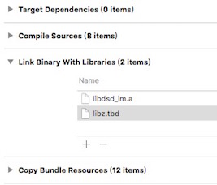

# imsdk-example-ios
The demo program for using Dasudian IM iOS SDK
# 集成IOS SDK前的准备工作
## 注册开发者账号并且创建后台应用
详细操作步骤见开发者注册及管理后台

## 制作并上传推送证书

如果不需要实现离线推送功能，请忽略这步

step1. 打开苹果开发者网站


step2. 从Member Center进入Certificates, Identifiers & Profiles


step3. 选择要制作的推送证书


* 对于开发环境(sandbox)的推送证书, 请选择 Apple Push Notification service SSL (Sandbox) 
* 对于生产环境(production)的推送证书, 请选择 Apple Push Notification service SSL (Production)

step4. 选择对应的APP ID 
 

step5. 根据Certificate Assistant的提示, 创建Certificate Request 


step6. 上传上一步中创建的Certificate Request文件


step7. 上传完毕后, 推送证书就被正确生成了, 之后我们下载下来这个证书, 并双击导入系统
 
   

## 上传推送证书

step1. 打开Application –> Utilities –> Keychain Access应用, 我们会看到有刚刚我们制作好的推送证书

step3. 登录管理后台

step4. 输入了正确的账号后, 选择对应的APP

step5. 填写的证书名称 

这个名称是个有意义的名字, 对推送直接相关, 稍后会在源码的修改里继续用到这个名字. 上传之前导出的P12文件, 密码则为此P12文件的密码, 证书类型请根据具体情况选择 

创建的是Apple Push Notification service SSL Sandbox请选择开发环境; Apple Push Notification service SSL Production请选择生产环境) 

step6. 上传 

请注意正确选择是生产环境还是测试环境的证书

* 在您阅读此文档时，我们假定您已经具备了基础的 iOS 应用开发经验，并能够理解相关基础概念。

# 下载SDK
* 注: 由于iOS编译的特殊性，为了方便开发者使用，我们将i386 x86_64 armv7 armv7s arm64几个平台都合并到了一起，所以SDK的静态库(.a文件)比较大。实际集成编译出ipa后，根据调用功能的多少，实际只会增加2MB左右。 

# SDK目录讲解

从官网上下载下来的包中分为如下三部分：
* iOS SDK 开发使用

* iOS release note 更新说明

* iOS UIDemo 工程源码

 IOS SDK中有三个子文件夹:include、lib、resources，请不要擅自修改这些文件夹的任何东西，下面依次介绍这三个子文件夹。
  
* lib 静态库,包含需要的静态库.a文件
* resources SDK的bundle  包含旧版SDK的数据

* include    包含SDK的头文件

介绍下include，所有的接口都在这个文件夹中。

## 配置工程
1. 导入SDK 
 
   将下载好的SDK文件夹拖入到项目中，并勾选上Destination 
   
   
    
2. 设置工程属性
 
  向Build Phases → Link Binary With Libraries 中添加依赖库 

   
   
SDK依赖库有 lib.tbd.

# 集成SDK基础功能
 SDK中的回调目前都是用代理实现的方法，方法简单易懂，方便用户实现各种回调的操作。
  
 SDK中基本客户端类提供了基本的单播，组播，广播等一系列方法，同时客户端类也定义了一系列的协议用于回调，比如收到单播消息的回调，收到广播消息的回调。客户端类功能简单易懂且功能全面。
    
# 初始化SDK 

```
    DSDIMClient *dsdimclient=[[DSDIMClient alloc]initWith:version                      
                                                    appID:appid
                                                  appSpec:appspec
                                                   userId:username
                                                 userinfo:userinfo          
                                              devicetoken:@"kmdesifaliowxcm"];

```                                                                           
* devicetoken是必须要带上的,如果不带上就初始化就会失败。 

## 登录                                                                            
初始化SDK的时候提供了回调方法，可以在此回调方法来选择做相应的跳转或用户提示  

 ```

     if(dsdimclient!=nil){
    
                  NSLog(@"初始化成功");
             
                          }else {
  
    UIAlertView *alertview = [[UIAlertView alloc]initWithTitle:@"提示"
                                                       message:@"登录出错，请检查网络和用户名密码"
                                                      delegate:nil
                                             cancelButtonTitle:@"取消"
                                             otherButtonTitles:@"确定", nil];
                [alertview show];
     }

 ```

        
## 重连
当掉线时，IOS SDK会自动重连，只需要监听重连相关的回调，无需进行任何操作。 

## 退出登录
当主动退出登录的时候调用方法 ：- (void)dsdDisConnect;

 ```
 - (IBAction)quitacton:(UIButton *)sender {
  
  
  [[DSDIMClient shareInstance] dsdDisConnect];
  
  [GroupManager shareInstance].mycreatgroups = nil;
  
  [GroupManager shareInstance].myjiongroups = nil;
  
  [self dismissViewControllerAnimated:YES completion:nil];
  

}

 
 ```

* 与初始化方法配合使用,该函数用于清除sdk分配得内存

 用户在登录成功后可以进行一下一些常见的操作,比如： 

 必须要指出的是不论是发消息还是接受消息，其中msg格式为：{“t”:"*" , "b":"string"}这个这个字段中的t指的是消息类型（必填项），b指的是消息体我们发出的消息内容。
## 异步单播发送消息：
在代码中导入客户端基本类 调用异步发送单播消息方法就OK了。


```

     // 组装发送的消息
       NSString *messagetext = textField.text;
  
    NSDictionary *messagedic = @{@"t":@"0",@"b":messagetext};
  
    NSData *jsonData = [NSJSONSerialization dataWithJSONObject:messagedic options:NSJSONWritingPrettyPrinted error:nil];
  
    NSMutableString *string = [[NSMutableString alloc]initWithData:jsonData encoding: NSUTF8StringEncoding];
  
    //异步发送消息
    [[DSDIMClient shareInstance]dsdAsynsendmessage:_loginerid
                                          userlist:@[self.friendid]
                                           number:1
                                          message:string
                                         messageid:[NSString ret16bitString]];
  
        NSLog(@"发送的单播消息是:%@",string);
  
       [_cellframdatas addObject:cellFrame];
       [_chatview.tableView reloadData];
  
     //5.自动滚到最后一行

```

## 同步单播发送消息：

用同步发送单播消息也是一样，只需要在下面这个回调方法里实现自己的回调就行了。

  ```
  
      /**
       *  同步发送单播消息.该方法会阻塞到收到服务器得ack或者超时后返回.
       *
       *  @param formuserid   用户的id
       *  @param userlist     消息接受者列表
       *  @param number       消息接受者数量
       *  @param message      消息内容，必须是字符串
       *
       *  @return   成功返回0，失败返回-1
       */
      - (NSInteger)dsdSyncsendmessage:(NSString *)formuserid
                             userlist:(NSArray *)userlist
                               number:(NSInteger)number
                              message:(NSString *)message;


 ```


## 收到单播消息的回调：
  
  
 ```
 
        /**
         *  收到单播消息的回调
         *
         *  @param reason  收到单播消息成功，reason=2
         *  @param data    发送成功 返回data数据结构为：
         {
           "msg":"消息",
           "from":"发送消息者",
           "time":"发送消息的时间"
         }
 
         *  @param len     返回的data的数据长度
         */
         @optional
       - (void)didReciveMessage:(NSInteger)reason 
                           data:(NSString *)data 
                          lenth:(NSInteger)len;
                          
                          
          //收到单播消息的回调
        - (void)loadthegroupdata:(NSNotification *)note{
  
            NSDictionary *dic = note.object;
  
            NSLog(@"过来的字典是:%@",dic);
  
  
           NSDictionary *messagejsondic = [dic objectForKey:@"msg"];
  
           NSString *messagebody = [messagejsondic objectForKey:@"b"];
  
  
          NSLog(@"传过来的字符串是:%@",messagebody);
  
  
  
         NSString *messagetype = [messagejsondic objectForKey:@"t"];
         NSLog(@"传过来的消息体是:%@",messagebody);
         NSLog(@"传过来的消息类型是:%@",messagetype);
  
         MessageModel *message = [[MessageModel alloc] init];
 
         message.text = [messagejsondic objectForKey:@"b"];
  
         message.time = [dic valueForKey:@"time"];
         message.type = 1;
 
  
        //3.创建一个CellFrameModel类
        CellFrameModel *cellFrame = [[CellFrameModel alloc] init];
        CellFrameModel *lastCellFrame = [_cellframdatas lastObject];
        message.showTime = ![lastCellFrame.messagemodel.time                      isEqualToString:message.time];
       cellFrame.messagemodel = message;
  
       if([[dic objectForKey:@"from"]isEqualToString:_friendid]){
  
       [_cellframdatas addObject:cellFrame];
  
      }
  
  
     //  回到主线程去刷新页面
  
       dispatch_async(dispatch_get_main_queue(), ^{
    
    
     [_chatview.tableView reloadData];
     //5.自动滚到最后一行
     NSIndexPath *lastPath = [NSIndexPath indexPathForRow:_cellframdatas.count - 1  inSection:0];
     [_chatview.tableView scrollToRowAtIndexPath:lastPath  atScrollPosition:UITableViewScrollPositionBottom animated:YES];
    
     });
  
  
    }                         

 ```


      
## 同步发送组播消息

## 调用SDK中的方法如下:

 ```
  
  
       /**
       *  同步发送组播消息,该方法会阻塞到收到服务器的ack或者超时后返回.
       *
       *  @param formuserid  用户id
       *  @param groupid     group id
       *  @param message     消息内容，必须是字符串类型
       *
       *  @return 成功返回0，失败返回-1。
       */

      - (NSInteger )dsdSyncMulticastsendmessage:(NSString *)formuserid
                                        groupid:(NSString *)groupid
                                        message:(NSString *)message;

        比如：

```
 

## 异步发送组播消息
    
```

       /**
        *  异步发送组播消息,该方法不会阻塞调用者.
        *
        *  @param formuserid 用户id
        *  @param groupid    groupid
        *  @param message    消息内容,必须是字符串格式
        *  @param messageid  消息序列号，用户指定得msgid,如果发送成功,该msgid会在回调方法里返回给用户(字符串类型，最好不要重复)
 
        */

       - (void)dsdAsynMulticastsendmessage:(NSString *)formuserid
                                   groupid:(NSString *)groupid
                                   message:(NSString *)message
                                 messageid:(NSString *)messageid;


      // 组装发送的消息
             NSString *messagetext = textField.text;
  
             NSDictionary *messagedic = @{@"t":@"0",@"b":messagetext};
  
            NSData *jsonData = [NSJSONSerialization dataWithJSONObject:messagedic options:NSJSONWritingPrettyPrinted error:nil];
            
            NSMutableString *string = [[NSMutableString alloc]initWithData:jsonData encoding: NSUTF8StringEncoding];
  
          //异步发送消息
     [[DSDIMClient shareInstance] dsdAsynMulticastsendmessage:_loginerid
                                                     groupid:_groupid
                                                     message:string
                                                   messageid:[NSString ret16bitString]];
  
       NSLog(@"发送的组播消息是:%@",string);
  
  
       [_cellframdatas addObject:cellFrame];
       
       [_chatview.tableView reloadData];
  
      //5.自动滚到最后一行


      
      
```
    

* 特别注意的地方是异步发送组播最后多了一个参数messageid，该missageid会在所有异步发送消息的代理回调方法里的参数data中返回给用户，开发者可以通过messageid来知道哪些消息发送成功了。

## 收到组播消息的回调

```
        //收到组播消息的回调
- (void)loadthegroupdata:(NSNotification *)note{

  NSDictionary *dic = note.object;
  
  NSLog(@"闯过来的字典是:%@",dic);
  
  
  NSDictionary *messagejsondic = [dic objectForKey:@"msg"];
  
  NSString *messagebody = [messagejsondic objectForKey:@"b"];
  
  
  NSLog(@"传过来的字符串是:%@",messagebody);
  
  NSString *messagetype = [messagejsondic objectForKey:@"t"];
  NSLog(@"传过来的消息体是:%@",messagebody);
  NSLog(@"传过来的消息类型是:%@",messagetype);
  
  MessageModel *message = [[MessageModel alloc] init];
  message.text = [messagejsondic objectForKey:@"b"];

  message.time = [dic valueForKey:@"time"];
  message.type = 1;


  //3.创建一个CellFrameModel类
  CellFrameModel *cellFrame = [[CellFrameModel alloc] init];
  CellFrameModel *lastCellFrame = [_cellframdatas lastObject];
  message.showTime = ![lastCellFrame.messagemodel.time isEqualToString:message.time];
  cellFrame.messagemodel = message;
  
  if([[dic objectForKey:@"groupid"]isEqualToString:_groupid]){
  
  [_cellframdatas addObject:cellFrame];
  
  }
  
  
    //  回到主线程去刷新页面
    
    dispatch_async(dispatch_get_main_queue(), ^{
      
      
      [_chatview.tableView reloadData];
      //5.自动滚到最后一行
      NSIndexPath *lastPath = [NSIndexPath indexPathForRow:_cellframdatas.count - 1 inSection:0];
      [_chatview.tableView scrollToRowAtIndexPath:lastPath atScrollPosition:UITableViewScrollPositionBottom animated:YES];
      
    });
  
  
}


```
    
## 同步发送广播消息

```
        /**
         *  同步得发送广播消息,该函数会阻塞到收到服务器得ack或者超时后返回.
         *
         *  @param formuserid  发送者id
         *  @param message     消息内容，必须是字符串格式
         *
         *  @return  成功返回0，失败返回-1；
         */

         - (NSInteger)dsdSyncBroadcastsendmessage:(NSString *)formuserid 
                                          message:(NSString *)message;


```
## 异步发送广播消息
```
        /**
         *  异步发送广播消息,该方法不会阻塞调用者
         *
         *  @param formuserid  发送者id
         *  @param message     消息内容，必须是字符串格式
         *  @param messageid   消息序列号，用户指定得msgid,如果发送成功,该msgid会在回调方法里        
            返回给用户(字符串类型，最好不要重复)
 
        */


        - (void)dsdAsynBroadcastsendmessage:(NSString *)formuserid
                                    message:(NSString *)message
                                  messageid:(NSString *)messageid;

        一般选择此方法发送广播消息。

```
## 收到广播消息的回调

```
 /**
         *  收到广播消息的回调
         *
         *  @param reason 收到广播消息成功，reason=4
         *  @param data   发送成功 返回data数据结构为：
          {
 
            "msg":"消息内容",
            "from":"发送消息者",
            "time":"发送消息的时间"
 
          }
         *  @param len    返回的data的数据长度
         */
         @optional
         - (void)didreciveBroadMessage:(NSInteger)reason 
                                  data:(NSString *)data 
                                  lenth:(NSInteger)len;

        示例：

//  收到广播消息的回调
- (void)loadtheboarddata:(NSNotification *)note{
  NSLog(@"通知传过来的信息是:%@",note);
  //  note 就是我们要的数据;

  
  NSDictionary *dic = note.object;
  
  
  MessageModel *message = [[MessageModel alloc] init];
  NSDictionary *messagedic = [dic valueForKey:@"msg"];
//  解析消息
  
  
  message.text = [messagedic objectForKey:@"b"];
  
  message.time = [dic valueForKey:@"time"];
  message.type = 1;
  
  //3.创建一个CellFrameModel类
  CellFrameModel *cellFrame = [[CellFrameModel alloc] init];
  CellFrameModel *lastCellFrame = [_cellframdatas lastObject];
  message.showTime = ![lastCellFrame.messagemodel.time isEqualToString:message.time];
  cellFrame.messagemodel = message;
  
 
  
  [_cellframdatas addObject:cellFrame];
    
  
  
  
  //  回到主线程去刷新页面
  
  dispatch_async(dispatch_get_main_queue(), ^{
    
    
    [_chatview.tableView reloadData];
    //5.自动滚到最后一行
    NSIndexPath *lastPath = [NSIndexPath indexPathForRow:_cellframdatas.count - 1 inSection:0];
    [_chatview.tableView scrollToRowAtIndexPath:lastPath atScrollPosition:UITableViewScrollPositionBottom animated:YES];
    
  });
  
}

```
## 创建组

```
       /**
        *  创建组播组,该方法会阻塞调用者.
        *
        *  @param creatuserid  创建者的userid
        *  @param groupName    组名，字符串类型
        *
        *  @return   成功返回组名，失败返回null。
        */

      - (NSString *)dsdCreatGroup:(NSString *)creatuserid 
                        groupName:(NSString *)groupName;

        方法示例：
       //创建群组
       - (IBAction)creatgroup:(UIButton *)sender {
       //拿到文本框信息
       NSString *groupname = _groupidtext.text;
  
       NSString *creatuserid = @"aaa";
  
       NSString *name= [[DSDIMClient shareInstance] dsdCreatGroup:creatuserid     
                                                        groupName:groupname];
  
       if(name==NULL){
  
         NSLog(@"创建失败");
  
  
        }else {
    
    
        if([GroupManager shareInstance].mycreatgroups.count==0){
    
       [GroupManager shareInstance].mycreatgroups = [[NSMutableArray alloc]init];
    
        }
    
         NSLog(@"创建成功组的名字为:%@",name);
         [[GroupManager shareInstance].mycreatgroups addObject:name];
    
         NSLog(@"我创建的群组的个数为:%d",[GroupManager      
         shareInstance].mycreatgroups.count);
  
    
    
        }


```

## 加入组

```
        /**
         *  加入组播组,该方法会阻塞调用者
         *
         *  @param joinuserid  加入者的userid
         *  @param groupid     加入组的组名，必须是字符串类型
         *
         *  @return 成功返回0，失败返回-1.
         */

         - (NSInteger) dsdJoinGroup:(NSString *)joinuserid 
                            groupid:(NSString *)groupid;

        方法示例：
        - (IBAction)jiongroup:(UIButton *)sender {
  
        //  获取文本框中的组id
  
        NSString *groupname = _groupidtext.text;
  
        NSString *jionuserid = @"aaa";
   
        NSInteger number = [[DSDIMClient shareInstance]
                             dsdJoinGroup:jionuserid 
                                  groupid:groupname];
        if(number ==0){
            NSLog(@"加入成功");
        if([GroupManager shareInstance].myjiongroups.count==0){
    
      [GroupManager shareInstance].myjiongroups = [[NSMutableArray alloc]init];
     
        }
     
       if(_groupidtext.text!=nil){
    
       [[GroupManager shareInstance].myjiongroups addObject:_groupidtext.text];
    
          NSLog(@"我加入的群组的个数为:%d",[GroupManager   
          shareInstance].myjiongroups.count);
      
       }
    
       }else{
    
        NSLog(@"加入失败");
  
      }

```

  
## 离开组

```
       /**
        *  离开组播组,该函数会阻塞调用者.
        *
        *  @param leaveuserid  离开者的userid
        *  @param groupid      组的id
        *
        *  @return 成功返回0，失败返回-1.
        */
        - (NSInteger) dsdLeaveGroup:(NSString *)leaveuserid 
                            groupid:(NSString *)groupid;


        方法示例：
       //离开群组的方法

       - (IBAction)LeaveGroup:(UIButton *)sender {
       // 获取群组的id
       NSString *idstring = self.cellnamestring;
  
       // 将此组从组数组中移除出去
       if(self.number==0){
   
       [[GroupManager shareInstance].mycreatgroups removeObject:idstring];
     
       NSLog(@"已经将此组从数组中移除掉了");
    
       NSInteger number1 = [[DSDIMClient shareInstance ]dsdLeaveGroup:@"aaa"
                                                          groupid:idstring];
     
       NSLog(@"离开组返回值是：%ld",number1);
    
       }else{
       [[GroupManager shareInstance].myjiongroups removeObject:idstring];
    
       NSInteger number2 = [[DSDIMClient shareInstance ]dsdLeaveGroup:@"aaa"
                                                           groupid:idstring];
    
       NSLog(@"离开组返回值是：%ld",number2);

       NSLog(@"已经将此组从数组中移除掉了");
    
    
       }
  
  
      [self.tableview reloadData];
  
      }


```

## 将某人踢出组

```
  /**
        *  将某人踢出组播组
        *
        *  @param creatuserid  组播组拥有者
        *  @param groupid      组的groupid
        *  @param groupmember  被踢出的人的id
        *
        *  @return 成功返回0，失败返回-1.
        */
        - (NSInteger)dsdKickOutGroup:(NSString *)creatuserid
                             groupid:(NSString *)groupid
                         groupmember:(NSString *)groupmember;


        方法示例：
        - (IBAction)kiickoutbutton:(UIButton *)sender {
       //  拿到文本框的数据
       NSString *groupid = _groupidtext.text;
  
       NSString *groupmemberid = _groupmemberidtext.text;
  
       //  开始踢人
  
       NSInteger number=[[DSDIMClient shareInstance]
                              dsdKickOutGroup:@"aaa"
                                      groupid:groupid
                                  groupmember:groupmemberid];
  
  
      if(number==0){
      UIAlertView *alertview=[[UIAlertView alloc]initWithTitle:@"群系统消息"
                                                       message:@"你把他成功踢出群组"
                                                      delegate:nil
                                             cancelButtonTitle:@"取消"
                                             otherButtonTitles:@"确定", nil];
       [alertview show];
                NSLog(@"踢人成功");
  
       }else{
               NSLog(@"踢人失败");
       UIAlertView *alertview = [[UIAlertView alloc]initWithTitle:@"群系统消息"
                                                          message:@"踢人失败"
                                                         delegate:nil
                                                 cancelButtonTitle:@"取消"
                                                 otherButtonTitles:@"确定",nil];
         [alertview show];
  
         }
  
       }
```

## 踢出组的回调：
  

```
        /**
         *  踢出组的回调
         *
         *  @param reason  踢出成功，reason=6
         *  @param data    成功，data为null
         *  @param len     返回的data的数据长度
         */
         @optional
         - (void)didKickOutGroup:(NSInteger)reason 
                            data:(NSString *)data 
                           lenth:(NSInteger)len;


```

### 此方法是sdk层封装的一个转换方法，用户可以用自己的方法去实现解析接收到的消息。
```
/**
 *  增加的一种数据转化方法，可以自己去解析回调函数中传回来的data值。
 *
 *  @param jsonString 传入的字符串
 *
 *  @return 返回解析后的字典
 */
- (NSDictionary *)dictionaryWithJsonString:(NSString *)jsonString;


```
       


                                                                       
                                                                            
                                                                              


