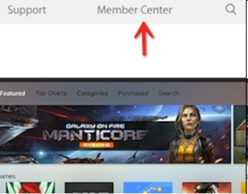
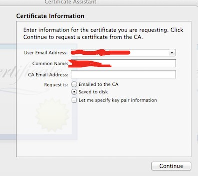
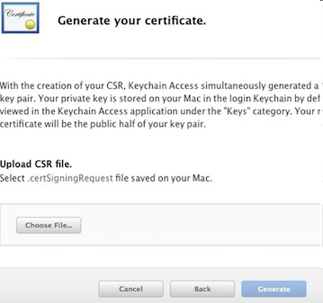
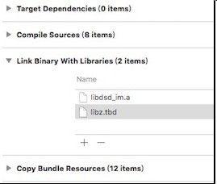

## Preparation for Integration
Register at [Dasudian Developer's Portal](https://dev.dasudian.com/) and create an App

If not registered, please use AppID: AppKey: for testing.

## Download SDK
Download Dasudian IM SDK from [Dasudian Website](http://www.dasudian.com/downloads/sdk/latest/im-sdk-ios.zip).

## Apply an Apple Certificate and Upload

(If not requiring to send PUSH to iOS devices, please ignore this step)

step1. login developer.apple.com with your browser



step2. From "Member Center" enter "Certificates, Identifiers & Profiles"


step3. Choose the PUSH certificate you are going to make


* For development and test (sandbox), please choose "Apple Push Notification service SSL (Sandbox)" 
* For production, plase choose "Apple Push Notification service SSL (Production)"

step4. Choose your APP ID 
 

step5. According to instruction by "Certificate Assistant", create Certificate Request 



step6. Upload the "Certificate Request" file from above step



step7. After uploading, the PUSH Certificate is created successfully, then download this certificate and double click to import into system
 
   

## Upload the PUSH Certificate

step1. Open Application –> Utilities –> Keychain Access on your Mac, you will see the PUSH Certificate made in above steps 

step2. Login [Dasudian Developer's Portal](https://dev.dasudian.com)

step3. Choose the corresponding APP and the IM service created for it (or create an IM service for this App)

step4. Fill in the name of the certificate on the page of configuring the IM service: this name is meaningful and is relevant with the PUSH service, and will be used in the code.

step5. Upload the P12 file which created at previous chapter to Dasudian Developer's Portal, and fill in corresponding password and certificate type: sandbox or production. 

step6. Click to upload 

* When you are reading this document we suppose you have enough experience on developing iOS applications, and able to understand the relevant basic concept.

# Download SDK
* Remark: Due to the specialty of iOS compilation, and in order to make it simple to developers, we compile the SDKs for i386, x86_64, armv7, armv7s and arm64 together, therefore the SDK (.a file) is a bit big. However, after you integrating the SDK and compile into IPA, the extra size added is just around 2MB.

# Anatomy of SDK

The SDK consists of three parts：

* libdsd_im.a: the static library of iOS, which will be imported into the project root directory

* DSDIMClient.h: the interface header file, which defines all the methods provided by Dasudian IM SDK

* RELEASENOTE.md: the description about the functions and updates of the current version of SDK

## Project Configuration
1.Import SDK 
 
   Drag the files in SDK package and drop into your project folder, and check the checkbox of "Destination" as below picture:
   
   
    
2.Modify the property of the project
 
  Add the libdsd_im.a under Build Phases → Link Binary With Libraries: 

   
   
  libdsd_im.a depends on libz.tbd.

## Integrate the basic functions of SDK
 All the callbacks in SDK are implemented with agent, simple and easy to understand.
  
 Within the SDK, class DSDIMClient provides unicast, group cast, broadcast methods, and this class define series protocols to implement callbacks, such as when receive an unicast message, broadcast message etc. The functionalities of DSDIMClient class are complete, simple and easy to use.
    
## Initialize SDK 

```
/**
 *  Initialize sdk, when quit need to call dsdDisConnect() to release the allocated memory space.
 *
 *  @param ocversion the version of SDK, current version is @"0.1"
 *  @param ocappid   the AppID registered at [Dasudian Developer's Portal](https://dev.dasudian.com)
 *  @param ocspec    the AppKey generated together with AppID at [Dasudian Developer's Portal](https://dev.dasudian.com)
 *  @param ocuserid  userid uniquelly identifying your user
 *  @param ocuserinfo optional user information used for statistics, which must be in JSON format
 *  @param ocdevicetoken device token uniquelly identifying a device for PUSH
 *  @param ocserveraddress  the server address (if it's nil, then defaultly connect to Dasudian Public Cloud);
 *  @return 成功返回当前的一个实例
 */
- (id)initWith:(NSString *)ocversion
         appID:(NSString *)ocappid
       appSpec:(NSString *)ocspec
        userId:(NSString *)ocuserid
      userinfo:(NSString *)ocuserinfo
   devicetoken:(NSString *)ocdevicetoken
 serverAddress:(NSString *)ocserveraddress;

```

## Login                                                                            
  
```
/**
 *
 *  the callback of successful connection
 *  @param reason  connect successfully, reason=5
 *  @param data    the data returned by server, which is null if success
 *  @param len     the length of the returned data
 */

@optional

- (void)callbackConnect:(NSInteger)reason data:(NSString *)data lenth:(NSInteger)len;

```

## Reconnect
When the connection is lost, IOS SDK will reconnect server automatically, and all the events will be notified to callbackConnect.

## Logout
When actively disconnect with server:- (void)dsdDisConnect;

```
/**
 *  quit the connection, after disconnecting the client will not receive any message including PUSH
 */
- (void)dsdDisConnect;
 
```

## Message Definition
All the messages sent or received must be in format:
```
{
  "t":"*" ,
  "b":"string"
}
```
"t" indicates the message type, which is mandatory

"b" is the message content in string format. if it's text, the string is the text itself; if it's multimedia the string is a URL

t - "0": text

t - "1": image

t - "2": audio

t - "3": video

t - "4": html5

## Aynchronous Unicast
After importing DSDIMClient class, just call dsdAsyncsendmessage to send messages

Notice: If using Dasudian Public Cloud, the maximum message is 1024 bytes for non-vip customers.

```
/**
 *  Asynchronous unicast, this method does not block.
 *
 *  @param formuserid userid of sender
 *  @param userlist   list of receivers
 *  @param number     number of receivers
 *  @param message    message body, must be a string of JSON
 *  @param messageid  msgid indicated by App if require to acknowledge the message received
 *                    if message sent sucessfully this msgid will be return to callback function
 */
- (void)dsdAsynsendmessage:(NSString *)formuserid
                  userlist:(NSArray *)userlist
                    number:(NSInteger )number
                   message:(NSString *)message
                 messageid:(NSString *)messageid;

```

## Synchronous Unicast

```
/**
 *  synchronous unicast. this method blocks the main thread.
 *
 *  @param formuserid   userid of sender
 *  @param userlist     list of receivers
 *  @param number       number of receivers
 *  @param message      message body, which must be a string of JSON
 *
 *  @return   success 0; fail -1
 */
- (NSInteger)dsdSyncsendmessage:(NSString *)formuserid
                       userlist:(NSArray *)userlist
                         number:(NSInteger)number
                        message:(NSString *)message;

```

## Callback for Receiving Unicast Message
  
```
 /**
 *  callback for receiving unicast message
 *
 *  @param reason  successfully receiving unicast message, reason=2
 *  @param data    the data received, in format:
{
	"msg":"message body in JSON"
	"from":"userid of sender",
	"time":"sending time"
}
 
 *  @param len     length of data received
 */
@optional
- (void)dsdReciveMessage:(NSInteger)reason data:(NSString *)data lenth:(NSInteger)len;

```

## Synchronous Send Group Message
```
/**
 *  synchronous send group message, this method blocks main thread.
 *
 *  @param formuserid  userid of sender
 *  @param groupid     group id, generated while creating a group
 *  @param message     the message body, a string of JSON
 *
 *  @return success 0; fail -1
 */

- (NSInteger )dsdSyncMulticastsendmessage:(NSString *)formuserid
                                  groupid:(NSString *)groupid
                                  message:(NSString *)message;

```
 

## Asynchronous Send Group Message
    
```
/**
 *  asynchronous sending group message, this method does not block main thread.
 *
 *  @param formuserid userid of sender
 *  @param groupid    groupid, generated while creating a group
 *  @param message    message body, a string of JSON
 *  @param messageid  msgid indicated by App if require to acknowledge the message received
 *                    if message sent sucessfully this msgid will be return to callback function
 */

- (void)dsdAsynMulticastsendmessage:(NSString *)formuserid
                            groupid:(NSString *)groupid
                            message:(NSString *)message
                          messageid:(NSString *)messageid;

```

* Notice: messageid will be used to acknowledge a message received, so it should be unique within the app at least during a time period. This messageid will be returned to callback function when this message is sent successfully.

## Callback for Receiving Group Message

```
/**
 *  callback for receiving group message
 *
 *  @param reason receive successfully, reason=3
 *  @param data   the data received in format:
{
	"msg":"Message body as JSON",
	"from":"userid of sender",
	"time":"sending time",
	"groupid":"group id"
}
 *  @param len    length of data received
 */
@optional
- (void)didReciveGroupMessage:(NSInteger)reason data:(NSString *)data lenth:(NSInteger)len;

```
    
## Synchronous Broadcast

```
/**
 *  synchronous broadcast, this method blocks the main thread.
 *
 *  @param formuserid  userid of sender
 *  @param message     message body, a string of JSON
 *
 *  @return  success 0; fail -1
 */

- (NSInteger)dsdSyncBroadcastsendmessage:(NSString *)formuserid message:(NSString *)message;

```
## Aynchronous Broadcast
```
/**
 *  asynchronous broadcast, this method does not block main thread
 *
 *  @param formuserid  userid of sender
 *  @param message     message body, string of JSON
 *  @param messageid  msgid indicated by App if require to acknowledge the message received
 *                    if message sent sucessfully this msgid will be return to callback function
 */

- (void)dsdAsynBroadcastsendmessage:(NSString *)formuserid
                            message:(NSString *)message
                          messageid:(NSString *)messageid;

```
It's recommended to choose thie method to send broadcast message

## Callback for Receiving Broadcast Message

```
/**
 *  callback receiving broadcast message
 *
 *  @param reason success to receive; reason=4
 *  @param data   data received, in format:
 {
 	"msg":"message body",
	"from":"userid of sender",
	"time":"sending time"
 }
 *  @param len    length of data received
 */
@optional
- (void)didreciveBroadMessage:(NSInteger)reason data:(NSString *)data lenth:(NSInteger)len;

```
## Create a Group

```
/**
 *  create group, this method blocks main thread.
 *
 *  @param creatuserid  userid of creator
 *  @param groupName    group name, a string
 *
 *  @return   if success return a unique groupid; if fail return null
 */

- (NSString *)dsdCreatGroup:(NSString *)creatuserid groupName:(NSString *)groupName;

```

## Join a Group

```
/**
 *  join group, this method blocks main thread
 *
 *  @param joinuserid  userid of joiner
 *  @param groupid     the groupid to join, returned while creating a group
 *
 *  @return success 0; fail -1.
 */

- (NSInteger) dsdJoinGroup:(NSString *)joinuserid groupid:(NSString *)groupid;

```
  
## Leave a Group

```
/**
 *  leave group, this method blocks main thread.
 *
 *  @param leaveuserid  userid of leaver
 *  @param groupid      groupid to leave from
 *
 *  @return success 0; fail -1.
 */
- (NSInteger) dsdLeaveGroup:(NSString *)leaveuserid groupid:(NSString *)groupid;

```

## Kickout a Use from Group

```
/**
 *  kick out
 *
 *  @param creatuserid  userid of group owner
 *  @param groupid      groupid
 *  @param groupmember  userid to be kicked out
 *
 *  @return sucess 0; fail -1.
 */
- (NSInteger)dsdKickOutGroup:(NSString *)creatuserid
                     groupid:(NSString *)groupid
                 groupmember:(NSString *)groupmember;

```

## Callback for Kicking Out

```
/**
 *  callback of kicking out
 *
 *  @param reason  success to kickout; reason=6
 *  @param data    the data is null if success
 *  @param len     lenght of the returned data
 */
@optional
- (void)didKickOutGroup:(NSInteger)reason data:(NSString *)data lenth:(NSInteger)len;

```
## Callback for sending Asynchronous Messages
```
/**
 *  callback for all the asynchronous sending methods
 *
 *  @param reason send successfully, reason=1;
 *  @param data   if sending successfully the returned data is messageid。
 *  @param len    length of the returned data
 */
@optional
- (void)didSendMessage:(NSInteger)reason data:(NSString *)data lenth:(NSInteger)len;

```

## Message Parsing
This is helper method provided by sdk for converting messages to dictionary
```
/**
 *  converting method for parsing the messages 
 *
 *  @param jsonString the string inputed
 *
 *  @return parsed dictionary
 */
- (NSDictionary *)dictionaryWithJsonString:(NSString *)jsonString;

```
