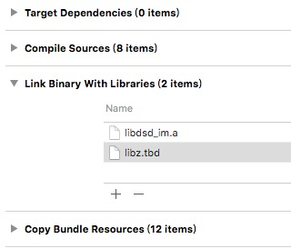

* 在您阅读此文档时，我们假定您已经具备了基础的 iOS 应用开发经验，并能够理解相关基础概念。

# 下载SDK
* 注: 由于iOS编译的特殊性，为了方便开发者使用，我们将i386 x86_64 armv7 armv7s arm64几个平台都合并到了一起，所以SDK的静态库(.a文件)比较大。实际集成编译出ipa后，根据调用功能的多少，实际只会增加2MB左右。 

# SDK目录讲解

从官网上下载下来的包中分为如下三部分：
* iOS SDK 开发使用

* iOS release note 更新说明

* iOS UIDemo 工程源码

 IOS SDK中有三个子文件夹:include、lib、resources，请不要擅自修改这些文件夹的任何东西，下面依次介绍这三个子文件夹。
  
* lib 静态库,包含需要的静态库.a文件
* resources SDK的bundle  包含旧版SDK的数据

* include    包含SDK的头文件

介绍下include，所有的接口都在这个文件夹中。

## 配置工程
1. 导入SDK 
 
   将下载好的SDK文件夹拖入到项目中，并勾选上Destination 
   
   
    
2. 设置工程属性
 
  向Build Phases → Link Binary With Libraries 中添加依赖库 

   
   
SDK依赖库有 lib.tbd.

  
    
      
      

 

